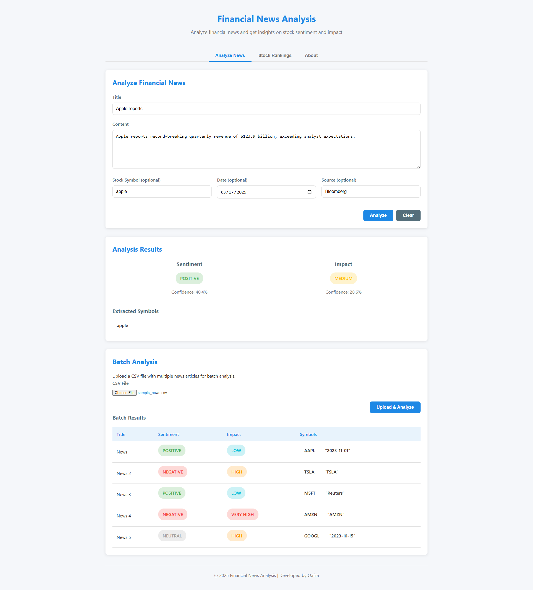
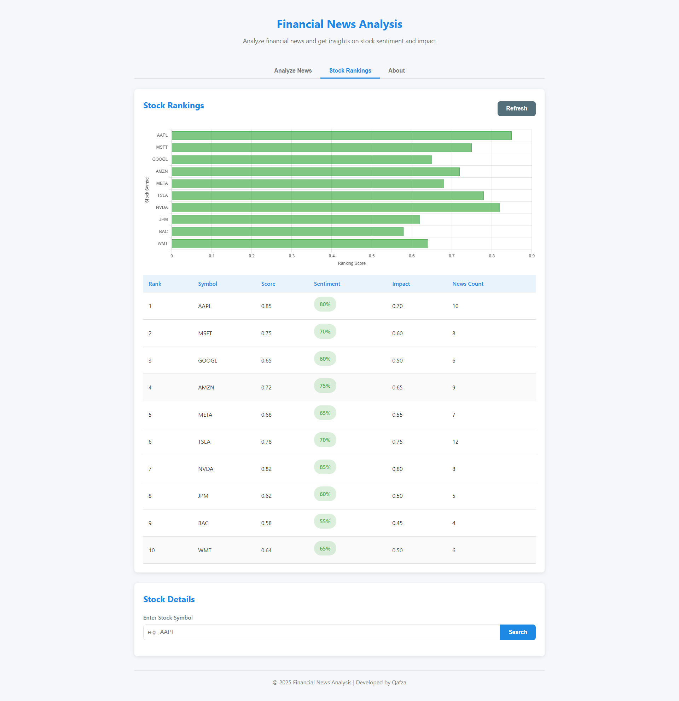
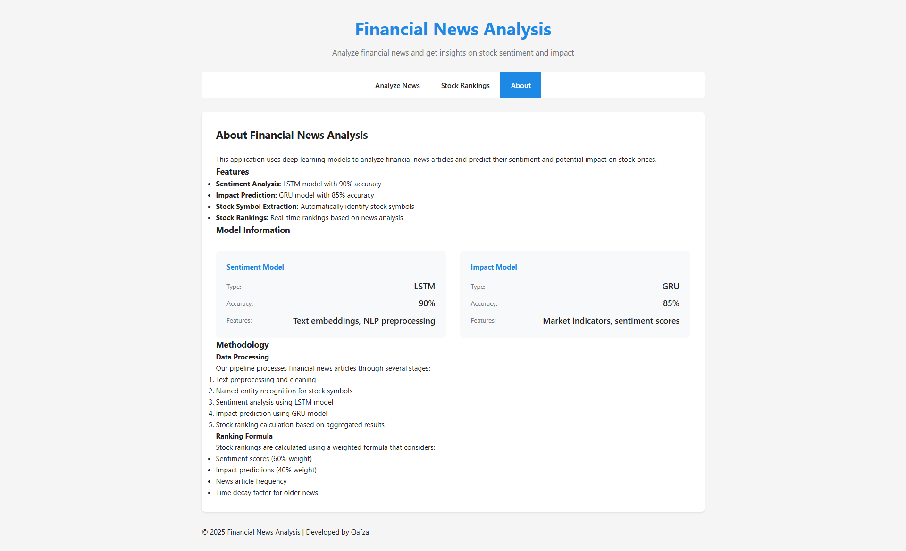

# Financial News Analysis Pipeline

## Overview
This project implements a financial news analysis pipeline that processes news articles to predict their sentiment and potential impact on stock prices. It includes both an API server and a web interface for easy interaction.

## Features
- Real-time news analysis
- Sentiment prediction
- Impact assessment
- Stock symbol extraction
- Stock rankings based on news analysis
- Interactive web interface
- RESTful API

## Screenshots
Here are some screenshots of the application interface:

### News Analysis Page


### Stock Rankings


### About Page


## Project Structure
```
.
├── app.py              # Main application file (API + Web UI)
├── pipeline.py         # Pipeline orchestration
├── requirements.txt    # Project dependencies
├── README.md          # Project documentation
├── data/              # Data directory
│   ├── raw/           # Raw news data
│   └── processed/     # Processed data
├── models/            # Trained models
├── src/               # Source code
│   ├── api/          # API implementation
│   ├── models/       # Model definitions
│   ├── features/     # Feature engineering
│   └── utils/        # Utility functions
├── tests/            # Test files
└── web/              # Web interface files
    ├── static/       # Static assets
    └── templates/    # HTML templates
```

## Setup
1. Clone the repository
2. Create a virtual environment:
   ```bash
   python -m venv venv
   source venv/bin/activate  # Linux/Mac
   venv\Scripts\activate     # Windows
   ```
3. Install dependencies:
   ```bash
   pip install -r requirements.txt
   ```

## Usage
1. Start the application:
   ```bash
   python pipeline.py
   ```
   This will start both the API server and web interface.

2. Access the web interface:
   - Open http://localhost:8003 in your browser

3. API Documentation:
   - Swagger UI: http://localhost:8002/docs
   - ReDoc: http://localhost:8002/redoc

## API Endpoints
- `POST /analyze`: Analyze a single news article
- `POST /batch-analyze`: Analyze multiple news articles
- `GET /rankings`: Get stock rankings
- `GET /rankings/{symbol}`: Get ranking for a specific stock

## Web Interface
The web interface provides:
- News analysis form
- Batch analysis upload
- Stock rankings visualization
- Stock details view
- Real-time updates via WebSocket

## Development
1. Run tests:
   ```bash
   pytest
   ```

2. Format code:
   ```bash
   black .
   isort .
   ```

3. Check code quality:
   ```bash
   flake8
   ```

